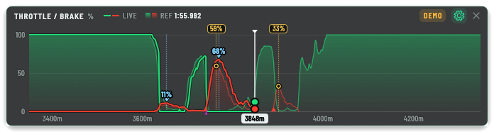
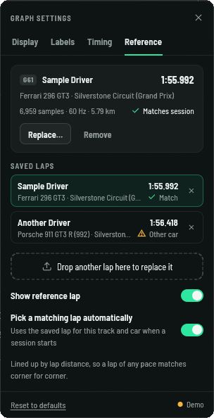
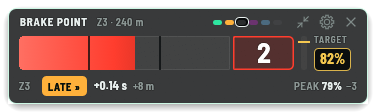
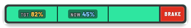
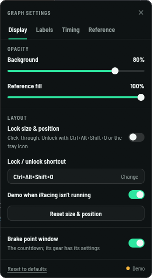
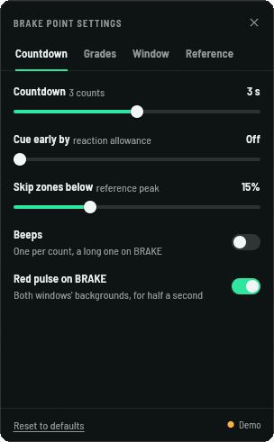

# Input Telemetry Overlay

An iRacing overlay that graphs your throttle and brake live against a reference lap from
[Garage 61](https://garage61.net), and picks the right reference lap for the track and car
by itself.



- **Your inputs against a fast lap, corner by corner.** The solid lines are your throttle
  and brake. The filled areas are the reference lap, lined up by lap distance, so a lap
  of any pace matches corner for corner.
- **Look-ahead.** The reference runs ahead of the white cursor (your car), so you can see
  the next braking zone coming.
- **Brake point countdown.** A second window counts 3-2-1-BRAKE into each of the reference
  lap's brake points, shows the zone's target peak pressure, and grades when your brake
  went on: perfect, good, early or late.
- **Brake peak labels.** The reference's peak pressure in gold at the top of a dotted
  line through each peak, clear of the traces; yours in light blue, pinned to the top of
  your brake line.
- **A lap library that follows you.** Every Garage 61 lap you load is kept. When a session
  starts, the overlay loads the saved lap for that track, layout and car.
- **Made to sit on top of the sim.** Transparent, resizable, click-through when locked,
  with its own settings window and a tray icon. Written in Rust and drawn with OpenGL, so
  it stays light next to the sim.

## Install

1. From [Releases](../../releases), download either:
   - `input-telemetry-overlay-<version>-windows-x64-setup.exe`, the installer. It installs
     for your Windows user without asking for administrator rights, and adds a Start menu
     shortcut, an uninstaller in **Settings → Apps**, and **Open with** for Garage 61
     CSVs. Run a newer one to upgrade.
   - `input-telemetry-overlay-<version>-windows-x64.zip`, the same program to unzip and
     run from anywhere.
2. Run the installer, or `input-telemetry-overlay.exe` from the zip. They aren't code
   signed, so Windows may warn that it protected your PC: choose **More info → Run
   anyway**.
3. In iRacing, use **windowed** or **borderless** display mode. Overlays can't draw on
   top of exclusive full screen.

Windows 10 or 11 with OpenGL 2 or newer (any GPU from the last decade). Uninstalling
keeps your settings and saved laps in `%APPDATA%\input-telemetry-overlay`.

With iRacing closed, the overlay runs a demo lap so you can position it and try the
settings. Turn that off in **Settings → Display**.

## Load a reference lap from Garage 61

1. Open a lap on garage61.net and export it as **CSV**. The file name looks like
   `Garage 61 - Driver - Car - Track (Layout) - 01.55.992 - ….csv`.
2. Drop the CSV on the overlay, or open **⚙ → Reference → Browse**. You can also drop it
   on the `.exe`, or pass it on the command line.

The lap is copied into the library (`%APPDATA%\input-telemetry-overlay\laps`), becomes the
reference, and is picked again automatically whenever you drive that track and car.



### How a lap is matched to a session

Garage 61 and the sim name tracks and cars differently: Garage 61 says "Silverstone
Circuit (Grand Prix)" where iRacing's session says "Silverstone Circuit" / "Arena Grand
Prix". So the overlay checks the lap itself:

- **Track and layout:** where the lap was driven (its GPS columns) against the track's
  location, and the lap's length (from its Speed column) against the session's track
  length, which tells layouts of one circuit apart.
- **Car:** the car name, allowing for suffixes ("Dallara P217" vs "Dallara P217 LMP2").
- Names are the fallback when the file has no speed or position columns.

A lap from another car on the same layout is still drawn, with a "Different car" note. A
lap from another track or layout is hidden, because its distances wouldn't line up.

Garage 61 exports the car's throttle, which includes the auto-blip on every downshift: a
spike of 50-75% that lasts from a few samples (Ferrari 296) to a fifth of a second
(Mustang, AMG). When a lap is loaded, the blip around each downshift in its Gear column is
flattened into a line between your throttle before and after it. The live line reads your
pedal (`ThrottleRaw`), which never has them.

## Brake point countdown



The brake point window counts down to each of the reference lap's brake points. The bar
fills in three steps (3, 2, 1), darkening as it builds, and turns solid red with **BRAKE**
at the moment the reference driver got on the brake. It runs on the reference lap's own
clock at your position, so if you're slower down the straight the counts stretch, but
BRAKE always lands on the reference brake point.

- **Target.** The zone's peak brake pressure on the reference lap, in gold, with your
  pedal filling the gauge beside it toward the gold line.
- **Timing.** When you brake, the bar briefly takes your grade's colour, and the row
  underneath shows the zone, the grade, and how far off you were in seconds and metres,
  then your peak against the target. Past the brake point without braking, the chip
  counts up until you do.

  | Grade | Your brake-on against the reference's (defaults) |
  | --- | --- |
  | Perfect | within ±0.03 s: the whole bar lights purple |
  | Good | within ±0.08 s |
  | Early / Late | 0.08–0.24 s early or late |
  | Very early / very late | more than 0.24 s |
  | No brake | you drove through without braking |

- **Pips** in the header show each zone's grade this lap (last lap's, dimmed, until you
  get there).
- **On the graph,** each brake point gets a red mark on the baseline, and your brake-on a
  bar under it in its grade's colour.
- **Compact.** The collapse button (next to the gear) shrinks the window to the bar, with
  the target, your pressure (then your final peak for a few seconds) and the distance to
  the next brake point inside it. Hover it for the expand button.



Both windows' backgrounds pulse red at each brake point, and the countdown can beep (off
by default). The window has its own background and contents opacity; turned down, what's
drawn on it keeps a dark backing so it reads over a bright sim.

## Using the overlay

| Action | How |
| --- | --- |
| Move | Drag the title bar (the compact brake point window: anywhere on it) |
| Resize | Hover a window, then drag a corner or edge anchor |
| Settings | A window's gear opens its settings; the tray icon opens the graph's |
| Close | The graph's × quits (as does the tray icon's Quit); the brake point window's × hides it: turn it back on in the graph's settings → Display |
| Lock (click-through) | Settings → Display → Lock size & position (both windows) |
| Unlock | **Ctrl+Alt+Shift+O** (change it in Settings → Display), or the tray icon |

### Settings

Each window's gear opens its own settings. The Reference tab, the lock and the brake
point window's on/off are in both.

| Tab | What's there |
| --- | --- |
| Display | Background and reference opacity, lock, unlock shortcut, demo mode, reset size & position, the brake point window on or off |
| Labels | Brake peak labels on or off; for your laps, the reference or both; minimum peak; the brake point marks |
| Timing | X-axis in distance or time; history behind the car; look-ahead; update rate (30 or 60 Hz) |
| Reference | The current reference and how it matches the session, the saved laps, loading CSVs, auto-pick |
| Countdown (brake point) | How long the three counts take; showing BRAKE early to allow for your reaction; skipping light zones; beeps; the red pulse |
| Grades (brake point) | The good and perfect windows, with the grades they make |
| Window (brake point) | Show it, compact, background and contents opacity, lock, reset size & position |

Settings and the library live in `%APPDATA%\input-telemetry-overlay`.




## Command line

```text
input-telemetry-overlay [options] [lap.csv ...]

  --demo                       Drive the simulated car, even if iRacing is running
  --settings <tab>             Open the settings on a tab: display, labels, timing, reference,
                               or the brake point window's countdown, grades, window
  --screenshot <png>           Save the overlay as a PNG after a second, then quit
  --settings-screenshot <png>  Save the settings window as a PNG too (opens it), then quit
  --cue-screenshot <png>       Save the brake point window as a PNG too, then quit
  --data-dir <dir>             Keep settings and laps here instead of %APPDATA%\input-telemetry-overlay
```

CSV files given on the command line are added to the library; the last one becomes the
reference. If the overlay is already running, they're handed to it.

## Build from source

Requires Rust 1.95 or newer on Windows.

```sh
cargo run --release              # the overlay
cargo run --release -- --demo    # with the simulated driver
cargo test
```

Without iRacing, a fake sim can stand in for the real one:

```sh
cargo run --example fake_iracing     # publishes iRacing's shared memory with a looping lap
cargo run --example iracing_probe    # prints what the telemetry reader sees
```

`cargo run --example graph_preview`, `cargo run --example cue_preview` and
`cargo run --example settings_preview` render the graph, the brake point window and the
settings panel on their own.

### Releases

Every push to `main` (a merged pull request, or a direct push) that passes CI is released
automatically: the installer and the zip are built and published on
[Releases](../../releases) as the next patch version, with notes on what changed since the
last one. For a minor or major release, raise the version in `Cargo.toml` first. A
`vX.Y.Z` tag pushed by hand is released too.

The installer is made with [Inno Setup](https://jrsoftware.org/isinfo.php) 6.3 or newer:
`installer/build.ps1` after `cargo build --release` puts it in `target\installer`. CI
builds it for every change, installs it, checks it and uninstalls it.

### How it's put together

| Path | What |
| --- | --- |
| `src/telemetry/` | iRacing reader thread (via the [kerb](https://crates.io/crates/kerb) crate) and the session-info parser |
| `src/lap.rs` | Garage 61 CSV parser and lap model |
| `src/library.rs`, `src/matching.rs` | Lap library and session matching |
| `src/trace.rs` | Live trace, brake events and lap-distance tracking |
| `src/cue.rs` | The brake point countdown: which zone is next, the count, and the grades |
| `src/ui/` | Graph renderer, brake point window, overlay chrome, settings panel and widgets (egui) |
| `src/app.rs`, `src/app/` | The app: windows, telemetry and demo, reference selection, tray and shortcut |
| `prototype/` | The HTML design prototype the UI was built from (`python -m http.server --directory prototype`) |

## Credits

- [egui/eframe](https://github.com/emilk/egui) for the UI and
  [kerb](https://github.com/mvoof/kerb) for iRacing's shared memory.
- [Barlow Semi Condensed](https://github.com/jpt/barlow) by The Barlow Project Authors,
  under the SIL Open Font License 1.1 (`assets/fonts/OFL.txt`).
- The bundled demo lap (Ferrari 296 GT3, Silverstone) is an anonymized Garage 61 export.

Not affiliated with iRacing or Garage 61.

## License

[MIT](LICENSE)

## CodeGraph

See [CodeGraph setup and review context](docs/codegraph.md) for the project-local
Claude/Codex server, per-checkout indexing and CLI commands.
